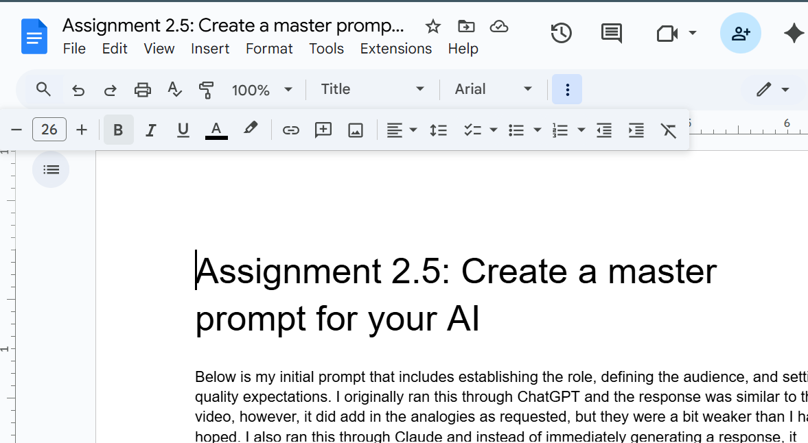
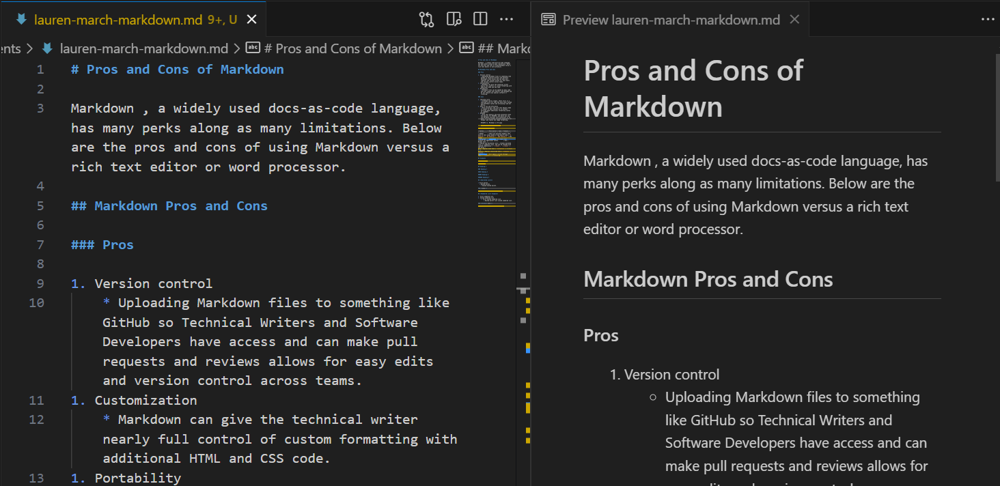
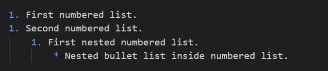

# **Pros and Cons of Markdown**

Markdown , a widely used docs-as-code language, has many perks along as many limitations. Below are the pros and cons of using Markdown versus a rich text editor or word processor.

## ***Markdown Pros and Cons***

### Pros

1. Version control
    * Uploading Markdown files to something like GitHub so Technical Writers and Software Developers have access and can make pull requests and reviews allows for easy edits and version control across teams.
1. Customization
    * Markdown can give the technical writer nearly full control of custom formatting with additional HTML and CSS code.
1. Portability
    * Markdown files can be opened by many code and even simple text editors like Notepad and do not require any special software or licensing.

### Cons

1. Learning curve
    * Although fairly simple, there still is a learning curve for some who have never worked with Markdown syntax and versioning like Git before.
1. Easy of use and efficiency
    * Word processors and rich text editors make it simple to edit content as is without worrying about additional formatting syntax to remember.
1. WYSIWYG
    * Rich text editors and word processors have the ability for WYSIWYG, and while you can see Markdown previews with extensions in VS Code, it's not always reliable especially for things like tables and image formatting.

    WYSIWYG vs. Markdown in VS Code

    

    

## ***Common Markdown Syntax***

| Syntax      | Description | Code | Example |
| ----------- | ----------- | ----- | -------- |
| Header      | There are multiple headers that vary in text sizes based on how many # used | `# Heading 1`, `## Heading 2`, `### Heading 3` | See below
| Paragraph   | Pargaraphs are simply text without any additional syntax.       | N/A | Normal text  |
| Ordered and Unordered lists | Creates bulleted lists or numbered lists, and can be stacked with layered indentation | `* [text]`,  `1.[text]` | See below |
Bold | Applies bold text | `**[text]**` | **[text]** |
Italics | Applies italicized text | `*[text]*` | *[text]* |
Strikethrough | Will apply a strike through text | `~~[text]~~` | ~~[text]~~

## ***Heading Examples***

# Heading 1

## Heading 2

### Heading 3

#### Heading 4

##### Heading 5

###### Heading 6

## ***Bulleted Lists Example***

* First bullet.
  * Nested bullet.
    * Second nested bullet.

### **Bulleted Lists Example Code:**

## ***Numbered Lists Example***

1. First numbered list.
1. Second numbered list.
    1. First nested numbered list.
        * Nested bullet list inside numbered list.

### **Numbered Example Code:**

